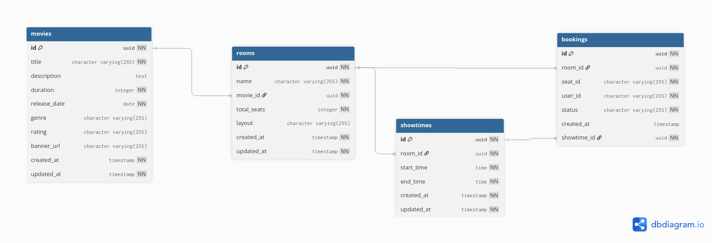

# Cinema Booking - Concorrência & Race Conditions

Estudo prático de concorrência, race conditions e locks distribuídos em Node.js com WebSockets.

## Objetivo

O objetivo desse projeto é simular um sistema de reserva de assentos de cinema e estudar problemas reais de concorrência, com foco em:

- **Race conditions** em ambiente assíncrono
- **Locks distribuídos** com Redis
- **Comunicação real-time** com WebSocket
- **Arquitetura em camadas** (Clean Architecture)

A ideia principal:

```txt
Múltiplos usuários tentando reservar o mesmo assento ao mesmo tempo.
```

## Funcionalidades

- **Listagem de filmes** com dados do TMDB
- **Salas e horários (showtimes)** por filme
- **Lock distribuído** de assentos com Redis (TTL 5min)
- **Reserva em batch** de múltiplos assentos em uma única request
- **WebSocket em tempo real** para atualização de assentos entre usuários
- **Keyspace Events** do Redis para liberação automática de locks expirados
- **Envio de email** com template de ticket de cinema (BullMQ + Mailhog)
- **Auditoria completa** de todos os eventos (locks, bookings, falhas)
- **Documentação Swagger** em `/docs`

## A Jornada: Resolvendo Race Conditions

### O Problema Inicial

Começamos com um store in-memory usando `Map`:

```ts
private bookings = new Map<string, Booking>();
```

Cada reserva usa uma chave única:

```ts
const key = `${booking.movieId}:${booking.seatId}`; // ex: "screen-1:A1"
```

### Implementação Ingênua (com race condition)

```ts
async book(booking: Booking): Promise<Booking> {
  const key = `${booking.movieId}:${booking.seatId}`;

  const alreadyBooked = this.bookings.has(key);

  if (alreadyBooked) {
    throw new Error('seat already booked');
  }

  await sleep(1); // ← JANELA DE RACE CONDITION

  this.bookings.set(key, booking);

  return booking;
}
```

### Por Que Isso Acontece no Node?

Muita gente acredita que Node não sofre race conditions porque é `single-threaded`. Mas isso só vale para **código síncrono**.

**Código síncrono é seguro:**

```ts
if (!map.has(key)) {
  map.set(key, value); // Executa sem interrupção
}
```

**Código assíncrono NÃO é seguro:**

```ts
if (!map.has(key)) {
  await sleep(1); // ← Outras requests entram aqui
  map.set(key, value);
}
```

O `await` cria uma janela onde ocorre **interleaving** de execuções.

### O Papel do `sleep()`

O `sleep()` não cria thread. Node continua usando **Event Loop**.

O objetivo do `sleep()` é **simular latência assíncrona** (banco de dados, Redis, HTTP, APIs externas).

---

### Evolução das Soluções

#### 1. Mutex Global

```ts
private mutex = new Mutex();

async book(booking: Booking): Promise<Booking> {
  return this.mutex.runExclusive(async () => {
    // região crítica protegida
  });
}
```

**Prós:**

- Resolve race condition completamente
- Simples de implementar

**Contras:**

- Serializa **todas** as operações
- A1 bloqueia B2, C3, etc.

---

#### 2. Mutex por Seat

```ts
private seatMutexes = new Map<string, Mutex>();

async book(booking: Booking): Promise<Booking> {
  const key = `${booking.movieId}:${booking.seatId}`;
  const mutex = this.getOrCreateMutex(key);

  return mutex.runExclusive(async () => {
    // só este assento é bloqueado
  });
}
```

**Prós:**

- A1 e B2 podem reservar simultaneamente
- Melhor throughput

**Contras:**

- Memory leak (mutexes nunca são removidos)
- **Não funciona multi-instância** (cada Node tem seu próprio Map)

---

#### 3. Redis Lock Distribuído (por showtime)

```ts
async book(booking: Booking): Promise<Booking> {
  // Lock é específico por sala + horário + assento
  const lockKey = `lock:${booking.roomId}:${booking.showtimeId}:${booking.seatId}`;

  const acquired = await redis.set(lockKey, userId, 'PX', 300000, 'NX');
  if (!acquired) {
    throw new Error('seat is locked');
  }

  try {
    // opera com exclusividade
  } finally {
    await redis.del(lockKey);
  }
}
```

**Comando Redis:**

```bash
SET lock:room-1:showtime-14h:A1 user-123 PX 300000 NX
```

**Flags:**

- `NX` → Only if Not eXists (só cria se não existir)
- `PX` → Expiração em milissegundos (TTL de 5 minutos)

**Prós:**

- Funciona com múltiplas instâncias
- Lock é compartilhado via Redis
- TTL previne deadlocks
- Memory-safe (Redis gerencia expiração)

---

### Arquitetura Multi-Instância

**Locks são específicos por showtime:**

- `lock:room1:showtime-14h:A1` → Usuário 1 pode travar
- `lock:room1:showtime-17h:A1` → Usuário 2 pode travar **ao mesmo tempo**
- `lock:room1:showtime-14h:A1` → Usuário 3 **não consegue** (já travado)

Todas as instâncias respeitam o mesmo lock.

## Arquitetura

### Visão Geral do Sistema

```
                                        ┌─────────────────┐
                                        │   Load Balancer │
                                        │     (nginx)     │
                                        └────────┬────────┘
                                                 │
                ┌────────────────────────────────┼────────────────────────────────┐
                │                                │                                │
                ▼                                ▼                                ▼
       ┌────────────────┐              ┌────────────────┐              ┌────────────────┐
       │  Node.js #1    │              │  Node.js #2    │              │  Node.js #N    │
       │  ┌──────────┐  │              │  ┌──────────┐  │              │  ┌──────────┐  │
       │  │ Express  │  │              │  │ Express  │  │              │  │ Express  │  │
       │  │   HTTP   │  │              │  │   HTTP   │  │              │  │   HTTP   │  │
       │  └────┬─────┘  │              │  └────┬─────┘  │              │  └────┬─────┘  │
       │  ┌────┴─────┐  │              │  ┌────┴─────┐  │              │  ┌────┴─────┐  │
       │  │ WebSocket│  │              │  │ WebSocket│  │              │  │ WebSocket│  │
       │  │ (Socket) │  │              │  │ (Socket) │  │              │  │ (Socket) │  │
       │  └────┬─────┘  │              │  └────┬─────┘  │              │  └────┬─────┘  │
       │  ┌────┴─────┐  │              │  ┌────┴─────┐  │              │  ┌────┴─────┐  │
       │  │ BullMQ   │  │              │  │ BullMQ   │  │              │  │ BullMQ   │  │
       │  │ Producer │  │              │  │ Producer │  │              │  │ Producer │  │
       │  └────┬─────┘  │              │  └────┬─────┘  │              │  └────┬─────┘  │
       └───────┼────────┘              └───────┼────────┘              └───────┼────────┘
               │                               │                               │
               └───────────────────────────────┼───────────────────────────────┘
                                               │
                     ┌─────────────────────────┼─────────────────────────┐
                     │                         │                         │
                     ▼                         ▼                         ▼
            ┌────────────────┐       ┌────────────────┐       ┌────────────────┐
            │     Redis      │       │   PostgreSQL   │       │  Worker Node   │
            │   ┌────────┐   │       │   ┌────────┐   │       │  ┌──────────┐  │
            │   │Locks   │   │       │   │Movies  │   │       │  │ BullMQ   │  │
            │   │Pub/Sub │   │       │   │Bookings│   │       │  │ Consumer │  │
            │   │Events  │   │       │   │Rooms   │   │       │  └────┬─────┘  │
            │   │Sessions│   │       │   │Showtime│   │       │       │        │
            │   │Queues  │   │       │   └────────┘   │       │       ▼        │
            │   │(BullMQ)│   │       └────────────────┘       │  ┌──────────┐  │
            │   └────────┘   │                                │  │   Jobs   │  │
            └────────────────┘                                │  │ - Audit  │  │
                                                              │  │ - Email  │  │
                                                              │  └──────────┘  │
                                                              └────────────────┘
```

### Schema do Banco de Dados



> **Obs:** A imagem não inclui a tabela `audit_logs` (adicionada posteriormente para auditoria de eventos).

### Fluxo de Lock com Redis

```
┌─────────────────────────────────────────────────────────────────────────┐
│                        LOCK ACQUISITION FLOW                            │
└─────────────────────────────────────────────────────────────────────────┘

  ┌─────────┐
  │ Client  │
  └────┬────┘
       │ POST /locks {roomId, showtimeId, seatId}
       ▼
  ┌─────────────────────────────────────────────────────────────────┐
  │                     Lock Service                                │
  │  ┌───────────────────────────────────────────────────────────┐  │
  │  │  lockKey = `lock:${roomId}:${showtimeId}:${seatId}`       │  │
  │  │  SET lockKey userId PX 300000 NX                          │  │
  │  └───────────────────────────────────────────────────────────┘  │
  └─────────────────────────────────────────────────────────────────┘
       │
       │  ┌─────────────────────────────────────────────────────────┐
       ├──┤ 1. NX → Only if Not eXists (cria se não existir)        │
       │  │ 2. PX → Expiração em 5 minutos (TTL)                    │
       │  └─────────────────────────────────────────────────────────┘
       ▼
  ┌─────────────────────────────────────────────────────────────────┐
  │                         REDIS                                   │
  │  ┌───────────────────────────────────────────────────────────┐  │
  │  │  lock:room-1:show-14h:A1 → "user-123" (TTL: 300s)         │  │
  │  └───────────────────────────────────────────────────────────┘  │
  └─────────────────────────────────────────────────────────────────┘
       │
       │  ┌─────────────────────────────────────────────────────────┐
       ├──┤ Broadcast via Socket.IO + Redis Adapter                 │
       │  └─────────────────────────────────────────────────────────┘
       ▼
  ┌─────────────────────────────────────────────────────────────────┐
  │                    ALL CONNECTED CLIENTS                        │
  │  ┌───────────────────────────────────────────────────────────┐  │
  │  │  { type: "SEAT_SELECTED", seatId: "A1", expiresAt: ... }  │  │
  │  ────────────────────────────────────────────────────────────┘  │
  └─────────────────────────────────────────────────────────────────┘
```

## Documentação da API (Swagger UI)

A API é documentada com **Swagger** e está disponível na rota: `/docs`

## Tecnologias

### Backend

| Tecnologia                                                                                                               | Versão | Descrição          |
| ------------------------------------------------------------------------------------------------------------------------ | ------ | ------------------ |
|  Node.js            | 22     | Runtime            |
|  TypeScript | -      | Linguagem          |
|  Express          | 5      | Framework HTTP     |
|  Zod                               | -      | Validação          |
|  PostgreSQL | 16     | Banco relacional   |
|  Knex                                                              | -      | Query builder      |
|  Redis                | 7      | Locks distribuídos |
|  Socket.IO                      | 8      | WebSocket          |
|  Pino                              | 10     | Logger             |
|  Vitest             | 4      | Testes             |
|  Docker             | -      | Containers         |

### Frontend

| Tecnologia                                                                                                               | Versão | Descrição       |
| ------------------------------------------------------------------------------------------------------------------------ | ------ | --------------- |
|  Next.js            | 16     | Framework React |
|  React                | 19     | Biblioteca UI   |
|  TypeScript | -      | Linguagem       |
|  Tailwind | 4      | CSS Framework   |
|  shadcn/ui                                                      | -      | Componentes UI  |
|  Lucide                                                            | -      | Ícones          |

## Setup

```bash
git clone <repo-url>
cd cinema-booking

# Infraestrutura
docker-compose up -d postgres redis mailhog

# Instalar dependências
pnpm install

# Rodar migrations
pnpm migrate:latest

# Iniciar apps
pnpm dev
```

**Variáveis de ambiente:**

| Variável     | Descrição                          | Exemplo                       |
| ------------ | ---------------------------------- | ----------------------------- |
| `PORT`       | Porta em que a API será iniciada   | `3000`                        |
| `DB_HOST`    | Host do banco de dados PostgreSQL  | `localhost`                   |
| `DB_PORT`    | Porta do banco de dados PostgreSQL | `5432`                        |
| `DB_NAME`    | Nome do banco de dados             | `cinema_booking`              |
| `REDIS_HOST` | Host da instância Redis            | `localhost`                   |
| `REDIS_PORT` | Porta da instância Redis           | `6379`                        |
| `SMTP_HOST`  | Host do servidor SMTP (MailHog)    | `localhost`                   |
| `SMTP_PORT`  | Porta do servidor SMTP             | `1025`                        |
| `EMAIL_FROM` | Remetente padrão dos e-mails       | `Cinema <noreply@cinema.com>` |

### WebSocket Events

**Conexão:** `ws://localhost:3000/ws` (mesma porta do HTTP + path `/ws`)

| Evento          | Direção         | Payload                               | Descrição      |
| --------------- | --------------- | ------------------------------------- | -------------- |
| `seat_locked`   | Server → Client | `{roomId, seatId, userId, expiresAt}` | Lock adquirido |
| `seat_booked`   | Server → Client | `{roomId, seatId, userId}`            | Reserva criada |
| `seat_released` | Server → Client | `{roomId, seatId}`                    | Lock liberado  |
| `lock_expired`  | Server → Client | `{roomId, seatId}`                    | Lock expirou   |

**Exemplo de evento:**

```json
{
  "type": "SEAT_BOOKED",
  "roomId": "660e8400-e29b-41d4-a716-446655440001",
  "showtimeId": "8fa5eeb0-3bc4-4182-9cb9-7ba8f55ae873",
  "seatId": "A1",
  "userId": "550e8400-e29b-41d4-a716-446655440100"
}
```

## Testes

```bash
pnpm test

pnpm cleanup  # limpa banco e Redis
```

**Testes manuais:** use os arquivos em `http/` com a extensão REST Client (VSCode).

## Pub/Sub e Keyspace Events

### Pub/Sub (Socket.IO Redis Adapter)

Em um ambiente com múltiplas instâncias da aplicação, os usuários podem estar conectados a servidores diferentes. Para garantir que todos recebam as mesmas atualizações em tempo real, é utilizado o mecanismo de Pub/Sub do Redis.

Quando um servidor envia uma mensagem para uma sala WebSocket (`roomId`), o Redis repassa essa mensagem para as demais instâncias da aplicação. Dessa forma, todos os clientes conectados à sala recebem a atualização, independentemente do servidor ao qual estão conectados.

### Keyspace Events

Durante o processo de reserva, um assento pode ficar temporariamente bloqueado para evitar que outra pessoa o selecione ao mesmo tempo. Esse bloqueio é armazenado no Redis com um tempo de expiração.

Os Keyspace Events permitem que a aplicação seja notificada automaticamente quando esse bloqueio expira. O listener definido em `keyspace-listener.ts` monitora esses eventos, identifica qual assento foi liberado e envia uma atualização via WebSocket para que todos os clientes visualizem a mudança em tempo real.

**Fluxo:**

1. Usuário seleciona **sala + horário (showtime)** → vê assentos disponíveis
2. `POST /locks` com `{roomId, showtimeId, seatId}` → Redis SET `lock:roomId:showtimeId:seatId` com TTL 5min → broadcast `seat_locked`
3. TTL expira → Keyspace Event notifica → broadcast `lock_expired`
4. `POST /bookings/batch` → verifica locks → cria bookings no Postgres → libera locks → broadcast `seat_booked` → envia email com ticket

**Importante:** O lock é específico por **showtime**, então:

- Usuário 1 pode travar `A1` às **14:00**
- Usuário 2 pode travar `A1` às **17:00** (mesmo assento, horário diferente)
- Usuário 3 **não consegue** travar `A1` às **14:00** (já travado pelo Usuário 1)

## Processamento Assíncrono com BullMQ

O sistema utiliza **BullMQ** para processamento assíncrono de duas funcionalidades principais: **envio de e-mails** e **auditoria de eventos**.

### Arquitetura

```
┌──────────┐     ┌─────────────┐     ┌─────────────┐
│  Client  │────▶│  Controller │────▶│   Service   │
└──────────┘     └─────────────┘     └──────┬──────┘
                                            │ BullMQ
                    ┌───────────────────────┼───────────────────────┐
                    │                       │                       │
                    │    ┌─────────────┐    │    ┌─────────────┐    │
                    │    │ email Queue │    │    │ audit Queue │    │
                    │    └──────┬──────┘    │    └──────┬──────┘    │
                    │           │           │           │           │
                    │           ▼           │           ▼           │
                    │    ┌─────────────┐    │    ┌─────────────┐    │
                    │    │ Email Worker│    │    │ Audit Worker│    │
                    │    └──────┬──────┘    │    └──────┬──────┘    │
                    │           │           │           │           │
                    └───────────┼───────────┴───────────┼───────────┘
                                │                       │
                    ┌───────────▼───────────┐  ┌────────▼────────┐
                    │      Mailhog          │  │   PostgreSQL    │
                    │      (SMTP)           │  │   audit_logs    │
                    └───────────────────────┘  └─────────────────┘
```

### Serviços Utilizados

| Serviço        | Tecnologia | Finalidade                           |
| -------------- | ---------- | ------------------------------------ |
| **BullMQ**     | Redis      | Gerencia filas de jobs em background |
| **Nodemailer** | SMTP       | Envia e-mails de confirmação         |
| **Mailhog**    | SMTP fake  | Captura e-mails em desenvolvimento   |
| **PostgreSQL** | Banco      | Persiste eventos de auditoria        |

---

## Envio de E-mail

E-mails de confirmação de reserva são enviados de forma assíncrona para não bloquear a resposta ao usuário. O email tem um **design de ticket de cinema** com filme, horário, sala, assentos e código de barras.

### Acessar e-mails (Mailhog)

```bash
# Subir Mailhog
docker-compose up -d mailhog

# Acessar interface web
http://localhost:8025
```

## Auditoria de Eventos

Todos os eventos importantes do sistema são registrados para rastreabilidade e debugging.

### Eventos Auditados

| Evento            | Quando                      | Aggregate ID                          |
| ----------------- | --------------------------- | ------------------------------------- |
| `lock.acquired`   | Lock adquirido com sucesso  | `lock:{roomId}:{showtimeId}:{seatId}` |
| `lock.released`   | Lock liberado manualmente   | `lock:{roomId}:{showtimeId}:{seatId}` |
| `lock.expired`    | Lock expirou (TTL)          | `lock:{roomId}:{showtimeId}:{seatId}` |
| `lock.conflict`   | Tentativa de lock duplicado | `lock:{roomId}:{showtimeId}:{seatId}` |
| `booking.created` | Reserva criada              | `bookingId`                           |
| `booking.failed`  | Falha na reserva            | `userId`                              |

### Tabela `audit_logs`

| Coluna         | Tipo        | Descrição                          |
| -------------- | ----------- | ---------------------------------- |
| `id`           | UUID        | ID único do evento                 |
| `event_type`   | VARCHAR     | Tipo do evento (ex: lock.acquired) |
| `aggregate_id` | UUID        | ID da entidade relacionada         |
| `user_id`      | VARCHAR     | Usuário que originou o evento      |
| `metadata`     | JSONB       | Dados contextuais do evento        |
| `occurred_at`  | TIMESTAMPTZ | Quando o evento ocorreu            |
| `created_at`   | TIMESTAMPTZ | Quando foi registrado no banco     |

### Exemplos de Queries

```sql
-- Todos os eventos de um lock específico
SELECT * FROM audit_logs
WHERE aggregate_id = 'lock:room-1:showtime-14h:A1'
ORDER BY occurred_at DESC;

-- Todos os eventos de um usuário
SELECT * FROM audit_logs
WHERE user_id = 'user-123'
ORDER BY occurred_at DESC;

-- Eventos de lock expirado nas últimas 24 horas
SELECT * FROM audit_logs
WHERE event_type = 'lock.expired'
  AND occurred_at > NOW() - INTERVAL '24 hours';
```

## Configuração Docker

### Estrutura de Serviços

- **API**: Node.js + Express na porta 3000
- **Web**: Next.js na porta 3001
- **PostgreSQL**: Banco de dados na porta 5432
- **Redis**: Cache/Queue na porta 6379
- **Mailhog**: Email testing na porta 8025 (UI) e 1025 (SMTP)
- **Adminer**: Database UI na porta 8082
- **Redis Commander**: Redis UI na porta 8081

### Setup Rápido

```bash
# Copiar arquivo de ambiente
cp .env.example .env

# Build e start de todos os serviços
docker compose up --build -d

# Ver logs em tempo real
docker compose logs -f

# Verificar status
docker compose ps
```

> **Nota:** As migrations e seeds são executadas automaticamente na primeira inicialização da API.

### Acessar Serviços

| Serviço                | URL                                                    | Descrição                          |
| ---------------------- | ------------------------------------------------------ | ---------------------------------- |
| **API**                | http://localhost:3000                                  | Backend REST + WebSocket           |
| **Web**                | http://localhost:3001                                  | Frontend Next.js                   |
| **Swagger (API Docs)** | http://localhost:3000/docs                             | Documentação interativa da API     |
| **Adminer (DB UI)**    | http://localhost:8082 (user: `postgres`, pass: `postgres`) | Interface do banco de dados        |
| **Mailhog (Email UI)** | http://localhost:8025                                  | Visualização de e-mails enviados   |
| **Redis Commander**    | http://localhost:8081                                  | Interface do Redis                 |

### Comandos Úteis

```bash
# Rebuildar um serviço específico
docker compose build api
docker compose build web

# Reiniciar serviços
docker compose restart api web

# Ver logs de um serviço
docker compose logs api
docker compose logs web

# Parar tudo e limpar volumes
docker compose down -v

# Executar comandos dentro dos containers
docker compose exec api sh
docker compose exec web sh
```

### Rodando Migrations e Seeds Manualmente

```bash
# Rodar migrations
docker compose exec api npx knex migrate:latest --knexfile knexfile.ts

# Rodar seeds
docker compose exec api npx knex seed:run --knexfile knexfile.ts

# Rollback de migration
docker compose exec api npx knex migrate:rollback --knexfile knexfile.ts
```

## Estrutura do Projeto

```
cinema-booking/
├── apps/
│   ├── api/                 # Backend Node.js + Express
│   │   ├── src/
│   │   │   ├── application/ # Services (Booking, Email, Audit)
│   │   │   ├── audit/       # Módulo de auditoria
│   │   │   ├── booking/     # Módulo de reservas
│   │   │   ├── infra/       # PostgreSQL, Redis, WebSocket, Queues
│   │   │   ├── movie/       # Módulo de filmes
│   │   │   ├── room/        # Módulo de salas
│   │   │   ├── showtime/    # Módulo de horários
│   │   │   └── server.ts    # Entry point
│   │   └── package.json
│   └── web/                 # Frontend Next.js + shadcn
│       ├── app/             # App Router (pages)
│       ├── components/      # UI components
│       ├── hooks/           # Custom hooks (useFetch, useLock, useWebSocket)
│       └── package.json
│── docker-compose.yml       # Infraestrutura (Postgres, Redis, Mailhog)
└── pnpm-workspace.yaml      # Monorepo config
```
